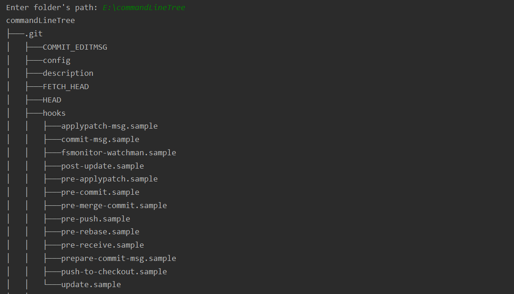
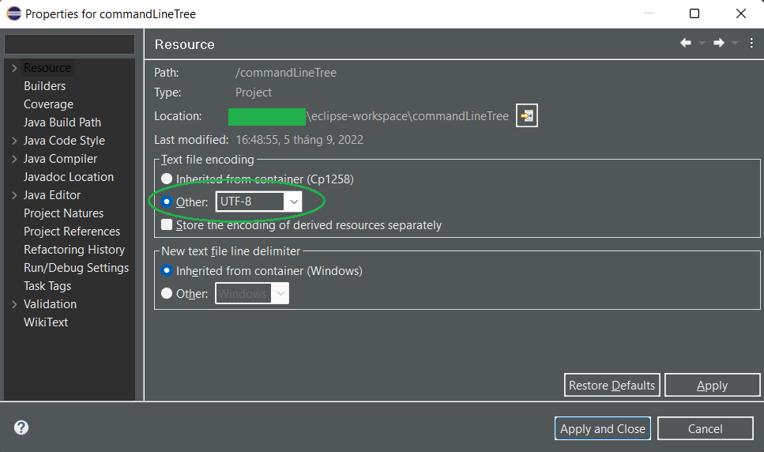
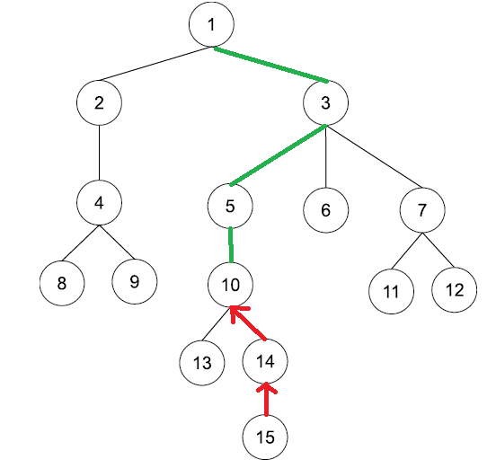
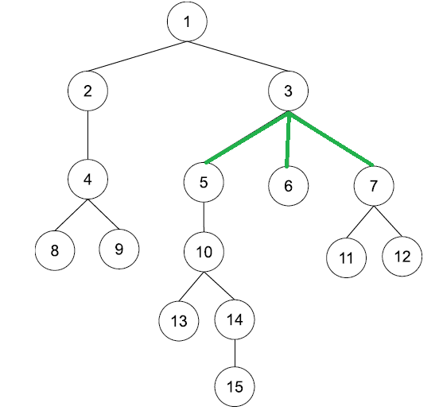
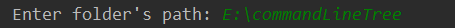
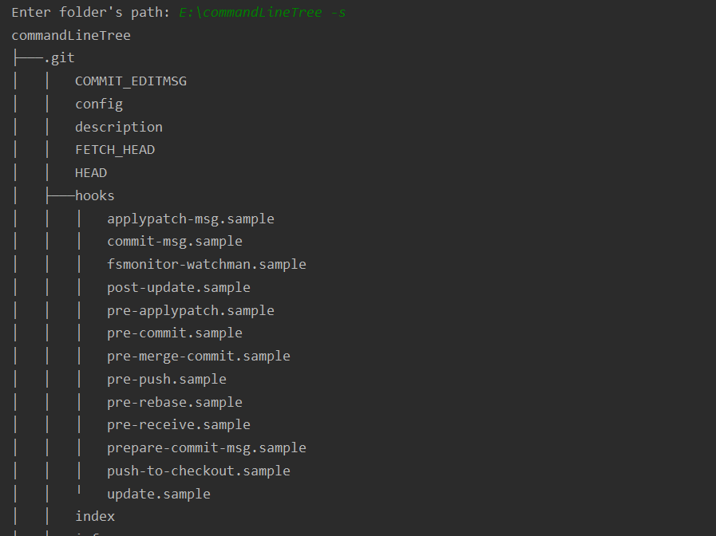

# commandLineTree

A Console-based program to print tree of folders and files of any given path.

Besides, This project provides the implementation of `Tree ADT` that acts as a Set (Collection) and can be reused in any
other projects. Moreover, the Tree ADT supports weight along each edge. The source code for the Tree and its components
is located at `..\commandLineTree\src\logicLayer\tree\`

The Tree ADT implementation supports some methods such as:

- Get subtree of a node
- Move subtree of node A to node B
- AddNode(To parent, From Child)
- Get value (label) at given index in pre-order traversal
- Find the lowest common ancestor of two given labels
- Pre-order Traversal
- Get level of a node
- Get height of a node
- and many more...

## How to use Tree class:

- Initialize new Tree instance: `Tree<data_type> t = new Tree<>()`
- Add new label to the tree: `t.add(18)`

See `test.java` for more.

## Note

For some environments such as `Windows cmd` or `Eclipse`, the program may not be displayed correctly due to the use of
extended ASCII characters. Please use any text file encoding in your IDE that supports extended ASCII like UTF-8. For
example, in `Eclipse`:

Besides, `IntelliJ IDEA` has no display problem when running the program.

## Techniques

- This program redesigns Dr. Le, Minh Duc's fundamental design (`Node` - `Edge`) to implement the abstract data
  type `Tree` (ADT).
- It also implements Java's `Set` interface.
- A feature that stands out from the prototype design is:
   Instead of using two `Vector` properties to store `Node` and `Edge`, the program is built around two `HashMap`
  properties to reduce time complexity while traversing the tree.

Specifically, The first `HashMap` attributes is `HashMap<Node<E>, Edge<E>> parentEdges`.
 
This property allows edge storage that connects a node to its parent node. With something similar to a `while` loop, it
is possible to trace the edges of each node to the ancestral nodes all the way to the root of the tree.

 The Second `HashMap` attributes is `HashMap<Node<E>, List<Edge<E>>> properF1DescEdges`. It records each node's
edges to its "F1" child nodes.  

## Usage

Enter the path of the desired folder.

## Optional Argument

There is an optional argument when typing your path to style the Tree: ` -s`.

A Complete syntax should be `--path [-s]`
<pre>
For example:
C:/your-path/a-folder/ -s
</pre>
With this argument, It is possible to distinguish between directory and file.

## About the author

Phan Quang Tuan, a Software Engineering student of FIT HANU.

References:
 [1] Dr. Le, Minh Duc. (2021). <i>Object Oriented Program Development Undergraduate Programming CourseBook</i>.
 [2] Mr. Dang Dinh Quan. <i>Software Engineering 1 Fall 2021 Course Slides.</i>
 [3] Liskov, B., & Guttag, J. (2001). <i>Program Development in Java: Abstraction, Specification, and
Object-Oriented Design.</i> Addison-Wesley.

## License

This program is released under the MIT License.