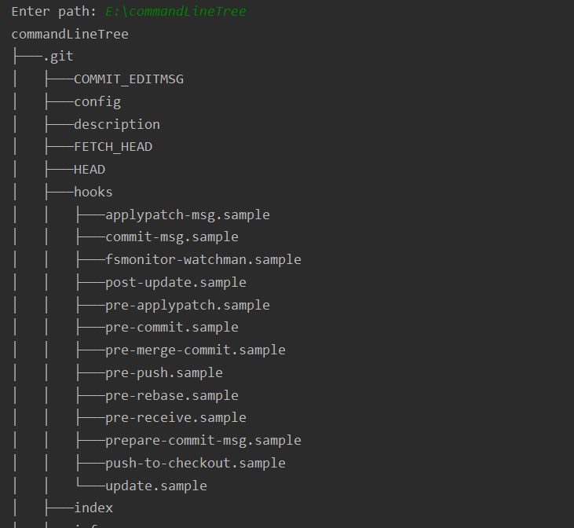
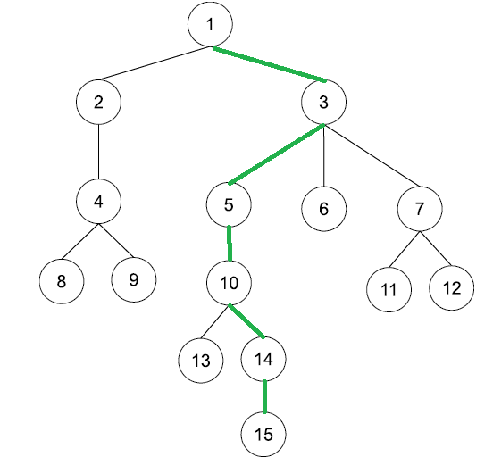
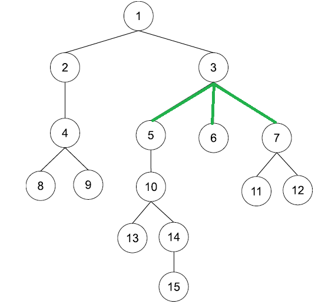
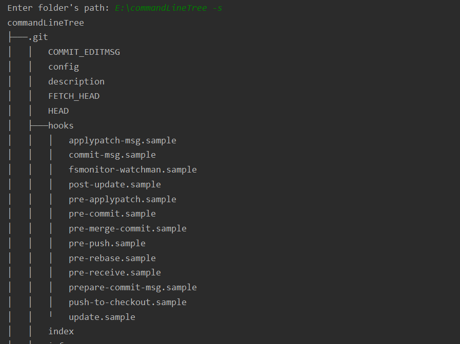

# commandLineTree

A Console-based program to print tree of folders and files of a specific path.

## Techniques

This program implements the abstract data type `Tree` (ADT), partially following the basic design of Dr. Le, Minh Duc.
 A feature that stands out from the prototype design is the `Tree` implemented to Java's `Collection` interface.
 Moreover, it does use two `HashMap` attributes to reduce the time complexity while traversing the tree.

Specifically, The first `HashMap` attributes is `parentEdges`.
 
This property allows to trace the edges of each node to the ancestral nodes all the way to the root of the tree.

  
The Second `HashMap` attributes is `properF1DescEdges`. It records each node's edges to its "F1" child nodes.

## Usage

Enter the path of the desired folder.

## Optional Argument

There is an optional argument when typing your path to style the Tree: ` -s`.

A Complete syntax should be `--path [-s]`
<pre>
For example:
C:/your-path/a-folder/ -s
</pre>
With this argument, It is possible to distinguish between directory and file.

## About the author

Phan Quang Tuan, a Software Engineering student of FIT HANU.

References:
 [1] Dr. Le, Minh Duc. <i>Object Oriented Program Development Undergraduate Programming CourseBook</i>.
 [2] Mr. Dang Dinh Quan. SE1 F2021 Course Slides.
 [3] Liskov, B., & Guttag, J. (2001). <i>Program Development in Java: Abstraction, Specification, and
Object-Oriented Design.</i> Addison-Wesley.

## License

This program is released under the MIT License.
